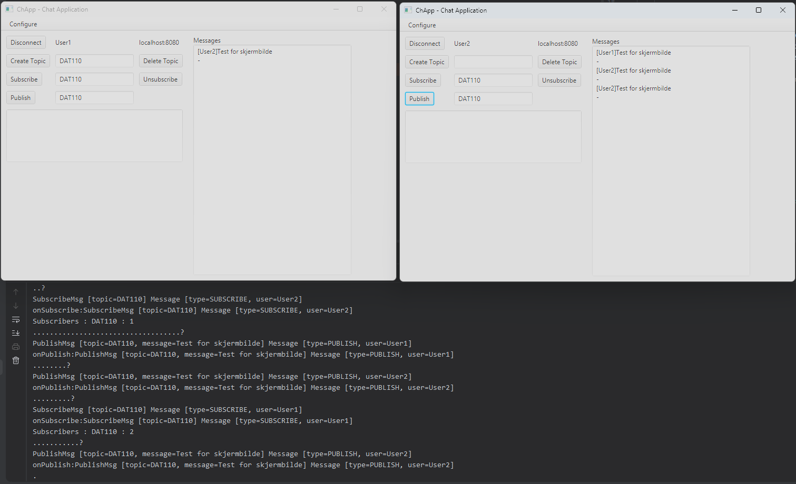

## DAT110 - Project 2: Publish-subscribe messaging middleware


Skjermbilde som viser at programmet fungerer
### Handing in the project

1. When the group is ready to hand-in, a **tagged commit** must be pushed to github in order to trigger an action which compiles the solution and runs all test on github. This is done using the following git commands - where *X* is to be replaced by a number:

```
%> git tag handinX
%> git push origin handinX
```

If you for some reason need to hand in again, then *X* will have to be a new number. **Note** it is no problem to push changes multiple times, but the github action is only triggered when you push a specific tag. You can go to your repository on github and check the result of executing the action by selecting the *Actions* tab as shown in the figure below.

2. The group must hand in a **link** on Canvas to the git-repository containing their implementation AND a screenshot showing the chat application in use. **Remember** to hand-in as a group as described in the guide available on Canvas.

3. The group must provide **read access** to their solution repository to the lab-assistent. The usernames of the lab-assistants are available via Canvas.

